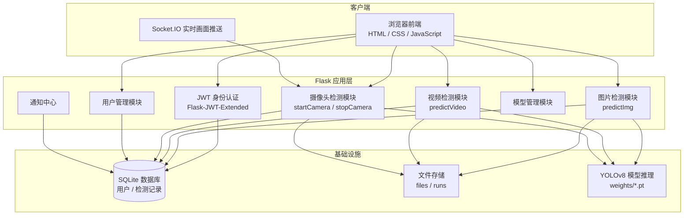
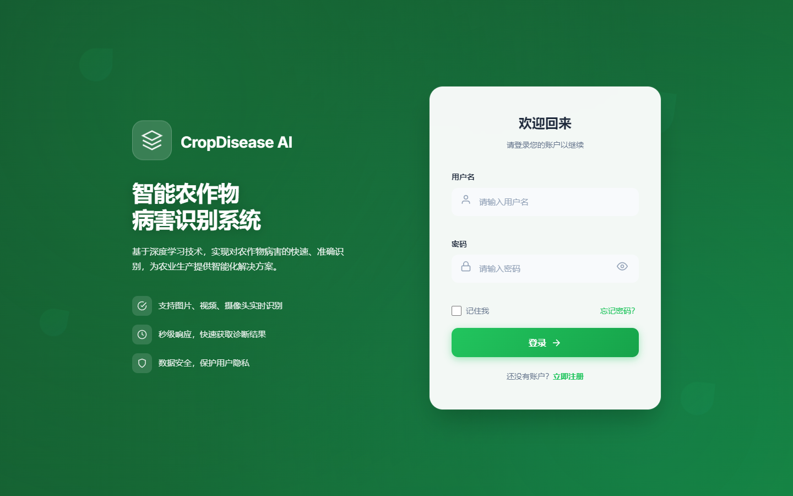
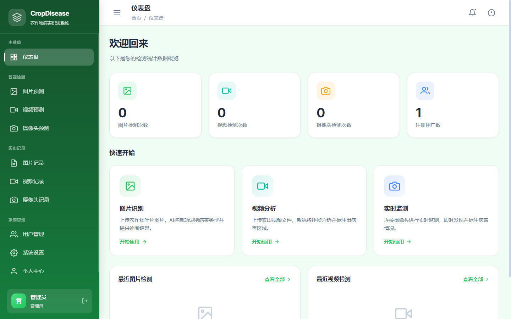
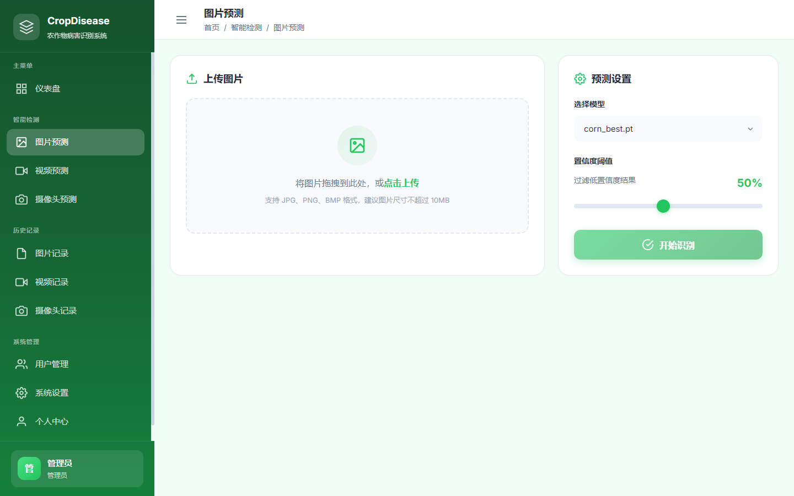
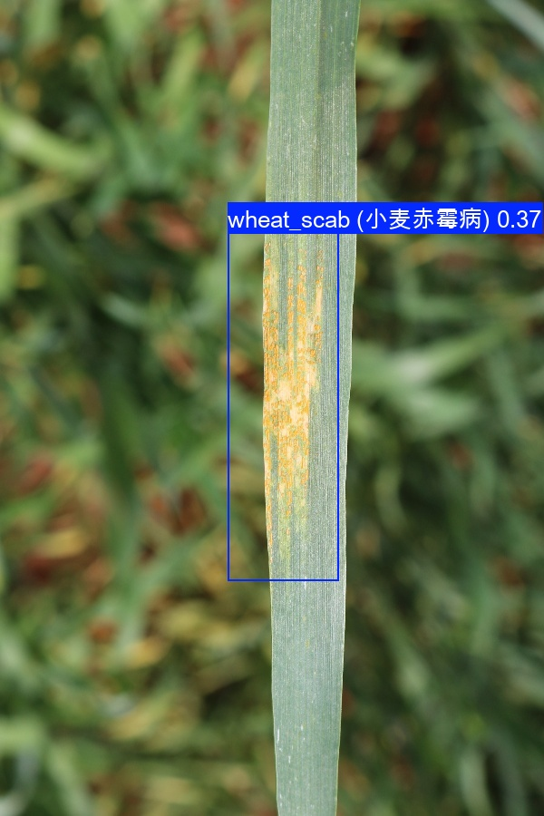

<div align="center" style="margin: 36px auto 16px;">

  <svg width="72" height="72" viewBox="0 0 96 96" fill="none" xmlns="http://www.w3.org/2000/svg" aria-hidden="true">
    <path d="M24 14 H12 V26" stroke="currentColor" stroke-width="2" stroke-linecap="round" opacity=".5"/>
    <path d="M72 14 H84 V26" stroke="currentColor" stroke-width="2" stroke-linecap="round" opacity=".5"/>
    <path d="M24 82 H12 V70" stroke="currentColor" stroke-width="2" stroke-linecap="round" opacity=".5"/>
    <path d="M72 82 H84 V70" stroke="currentColor" stroke-width="2" stroke-linecap="round" opacity=".5"/>
    <path d="M48 84 V38" stroke="currentColor" stroke-width="2.4" stroke-linecap="round" opacity=".85"/>
    <path d="M48 80 C 40 66, 30 57, 19 53 C 35 50, 44 59, 48 66 Z" fill="currentColor" fill-opacity="0.10" stroke="currentColor" stroke-width="1.8" stroke-linecap="round" stroke-linejoin="round" opacity=".85"/>
    <path d="M48 80 C 56 66, 66 57, 77 53 C 61 50, 52 59, 48 66 Z" fill="currentColor" fill-opacity="0.10" stroke="currentColor" stroke-width="1.8" stroke-linecap="round" stroke-linejoin="round" opacity=".85"/>
    <circle cx="12" cy="26" r="3" fill="currentColor" opacity=".6"/>
    <circle cx="84" cy="70" r="3" fill="currentColor" opacity=".6"/>
  </svg>

  <div style="margin-top: 18px; font-family: 'SF Mono', 'JetBrains Mono', Consolas, monospace; font-size: 0.72rem; letter-spacing: 0.3em; text-transform: uppercase; opacity: 0.55;">Crop Vision &middot; YOLOv8</div>

  <h1 style="margin: 14px auto 0; font-family: 'Noto Serif SC', 'Source Han Serif SC', 'Songti SC', SimSun, Georgia, serif; font-size: 2.4rem; font-weight: 600; letter-spacing: -0.01em; line-height: 1.2; border: none;">农作物病害识别系统</h1>

  <p style="margin: 14px auto 0; max-width: 52ch; font-size: 0.95rem; line-height: 1.8; opacity: 0.72;">基于 YOLOv8 深度学习模型的作物病害智能识别平台，支持图片、视频与摄像头实时检测，内置玉米、水稻、小麦三种作物预训练模型。</p>

  <p style="margin-top: 18px;">
    <a href="https://www.python.org/"></a>&nbsp;
    <a href="https://flask.palletsprojects.com/"></a>&nbsp;
    <a href="https://github.com/ultralytics/ultralytics"></a>&nbsp;
    <a href="LICENSE"></a>
  </p>

  <p style="margin-top: 20px; font-family: 'SF Mono', 'JetBrains Mono', Consolas, monospace; font-size: 0.8rem;">
    <span style="display: inline-block; padding: 5px 14px; margin: 0 4px 8px; border: 1px solid rgba(128, 128, 128, 0.4); border-radius: 4px;">图片检测</span>
    <span style="display: inline-block; padding: 5px 14px; margin: 0 4px 8px; border: 1px solid rgba(128, 128, 128, 0.4); border-radius: 4px;">视频检测</span>
    <span style="display: inline-block; padding: 5px 14px; margin: 0 4px 8px; border: 1px solid rgba(128, 128, 128, 0.4); border-radius: 4px;">摄像头实时检测</span>
  </p>

  <div style="margin: 18px auto 0; max-width: 430px; display: flex; align-items: center; gap: 14px; font-family: 'SF Mono', 'JetBrains Mono', Consolas, monospace; font-size: 0.72rem; letter-spacing: 0.14em; opacity: 0.55;">
    <span style="flex: 1; height: 1px; background: rgba(128, 128, 128, 0.3);"></span>
    <span>Flask &middot; SQLite &middot; JWT &middot; v2.2.0</span>
    <span style="flex: 1; height: 1px; background: rgba(128, 128, 128, 0.3);"></span>
  </div>

</div>

---

## 目录

1. [功能特性](#功能特性)
2. [技术栈](#技术栈)
3. [项目结构](#项目结构)
4. [系统架构](#系统架构)
5. [界面预览](#界面预览)
6. [环境要求](#环境要求)
7. [快速开始](#快速开始)
8. [使用说明](#使用说明)
9. [模型训练](#模型训练)
10. [模型性能](#模型性能)
11. [支持病害类型](#支持病害类型)
12. [API 接口](#api-接口)
13. [安全特性](#安全特性)
14. [数据库说明](#数据库说明)
15. [开发说明](#开发说明)
16. [环境变量配置](#环境变量配置)
17. [生产部署](#生产部署)
18. [常见问题](#常见问题)
19. [更新日志](#更新日志)
20. [贡献指南](#贡献指南)
21. [作者与致谢](#作者与致谢)

---

## 功能特性

### 🌱 核心功能

- **图片检测**：上传农作物图片，快速识别病害类型及位置
- **视频检测**：上传视频文件，逐帧检测病害并输出标注视频
- **摄像头实时检测**：调用本地摄像头，实时进行病害识别
- **历史记录**：保存所有检测记录，支持查看详情模态框、下载结果和删除
- **系统配置**：检测参数、置信度显示格式、通知等可自定义
- **模型管理**：支持上传自定义模型、删除自定义模型，动态加载可用模型
- **通知中心**：检测完成、新用户注册、系统更新等通知，支持已读标记

### 👥 用户系统

- **用户注册/登录**：支持多用户使用，JWT Token 认证
- **个人中心**：管理个人信息（姓名、性别、邮箱、电话），修改密码，查看检测统计
- **用户管理**：管理员可管理所有用户，支持添加/编辑/删除（管理员专属）
- **权限控制**：普通用户只能查看自己的记录，仪表盘隐藏注册用户数
- **信息完善提醒**：管理员创建用户时可只填必要信息，用户首次登录后弹窗提醒补全个人信息

### 🎨 界面设计

- **绿色农业主题**：清新的绿色系UI设计
- **响应式布局**：适配桌面端和移动端
- **现代化交互**：流畅的动画效果和友好的提示
- **直观操作**：简洁的操作流程，易于上手
- **详情模态框**：图片/视频/摄像头记录均支持弹窗详情查看

### 📋 关于系统

- **使用文档**：内置快速入门、图片检测、视频检测、摄像头检测、系统设置等文档
- **更新日志**：系统版本历史更新记录
- **技术支援**：开发团队联系方式、技术支持渠道

---

## 技术栈

### 后端

| 技术 | 说明 |
|------|------|
| Flask 3.x | Web 框架 |
| Flask-SQLAlchemy | ORM 数据库操作 |
| Flask-JWT-Extended | JWT 身份认证 |
| Flask-SocketIO | WebSocket 实时通信 |
| Flask-CORS | 跨域支持 |
| Ultralytics YOLOv8 | 目标检测模型 |
| OpenCV | 图像处理 |
| SQLite | 轻量级数据库 |
| Werkzeug | 密码哈希、文件安全 |

### 前端

| 技术 | 说明 |
|------|------|
| HTML5 | 页面结构 |
| CSS3 | 样式设计（绿色农业主题） |
| JavaScript (ES6+) | 交互逻辑 |
| Socket.IO Client | WebSocket 客户端 |
| Font Awesome 风格图标 | 图标系统 |

---

## 项目结构

```
crop-disease-detection/
├── main.py                 # 主程序入口
├── train.py                # 模型训练脚本
├── yolov8n.pt              # YOLOv8n 基础预训练权重（训练起点）
├── yolov8n.yaml            # YOLOv8n 网络结构配置
├── requirements.txt        # Python 依赖清单
├── .env.example            # 环境变量配置模板
├── .gitignore              # Git 忽略规则
├── README.md               # 项目说明文档
│
├── docs/                   # 文档资源
│   └── images/             # 界面预览截图
│       ├── login.png
│       ├── dashboard.png
│       ├── img_predict.png
│       └── demo-detection-corn.jpg
│
├── dataset/                # 数据集目录
│   ├── corn_dataset/       # 玉米病害数据集
│   │   ├── data.yaml
│   │   └── images/{train,val,test}/
│   ├── rice_dataset/       # 水稻病害数据集
│   └── wheat_dataset/      # 小麦病害数据集
│
├── instance/               # 数据库目录
│   └── cropdisease.db      # SQLite 数据库（自动生成）
│
├── weights/                # 模型权重目录
│   ├── corn_best.pt        # 玉米病害检测模型
│   ├── rice_best.pt        # 水稻病害检测模型
│   └── wheat_best.pt       # 小麦病害检测模型
│
├── templates/              # HTML 模板（12 个页面）
│   ├── login.html          # 登录页
│   ├── register.html       # 注册页
│   ├── dashboard.html      # 仪表盘
│   ├── img_predict.html    # 图片预测
│   ├── video_predict.html  # 视频预测
│   ├── camera_predict.html # 摄像头预测
│   ├── img_records.html    # 图片记录
│   ├── video_records.html  # 视频记录
│   ├── camera_records.html # 摄像头记录
│   ├── user_manage.html    # 用户管理
│   ├── personal.html       # 个人中心
│   └── system_settings.html # 系统设置
│
├── static/                 # 静态资源
│   ├── css/
│   │   ├── common.css      # 全局样式
│   │   └── sidebar.css     # 侧边栏样式
│   └── js/
│       └── common.js       # 公共工具库
│
├── files/                  # 上传文件存储（自动生成）
├── runs/                   # 检测结果临时目录（自动生成）
└── app.log                 # 运行日志（自动生成）
```

---

## 系统架构

系统采用 B/S 三层架构，浏览器端负责交互展示，Flask 后端提供 RESTful API 与 WebSocket 实时通信，底层使用 YOLOv8 模型进行目标检测，数据统一存储于 SQLite：



**核心检测流程**：用户上传图片/视频或开启摄像头 → Flask 接收请求并完成 JWT 鉴权 → 调用对应检测模块加载 YOLOv8 模型推理 → 保存检测记录与标注结果到数据库和文件存储 → 通过 RESTful API 或 WebSocket 将结果返回前端展示。

---

## 界面预览

### 登录页面

<p align="center"></p>

### 仪表盘

<p align="center"></p>

### 图片检测页面

<p align="center"></p>

### 检测效果示例

<p align="center"></p>

---

## 环境要求

### 硬件要求

- **CPU**：Intel i5 及以上（推荐 i7 或更高）
- **内存**：8GB 及以上（推荐 16GB）
- **GPU**：可选，NVIDIA GPU 可加速检测和训练
- **摄像头**：摄像头实时检测功能需要

### 软件要求

- **操作系统**：Windows 10/11、Linux、macOS
- **Python**：3.8 ~ 3.12
- **FFmpeg**：视频转码需要（可选，推荐安装）

### Python 依赖

详见 `requirements.txt`，主要依赖包括：

- Web 框架：Flask、Flask-SQLAlchemy、Flask-JWT-Extended、Flask-Cors、Flask-SocketIO
- 模型推理：ultralytics (YOLOv8)、opencv-python、numpy、Pillow
- 模型训练：torch、torchvision
- 工具库：requests、Werkzeug、python-socketio、PyYAML

---

## 快速开始

### 1. 克隆项目

```bash
git clone https://github.com/YanQvQ/crop-disease-detection
cd crop-disease-detection
```

### 2. 安装依赖

```bash
pip install -r requirements.txt
```

### 3. 准备模型文件

项目已内置玉米、水稻、小麦三种作物的预训练模型，位于 `weights/` 目录（目录结构见 [项目结构](#项目结构)），开箱即用。

### 4. 启动服务

```bash
python main.py
```

启动成功后，终端会显示：

```
 * Running on http://0.0.0.0:5000
```

### 5. 访问系统

打开浏览器访问：**http://localhost:5000**

### 6. 默认账号

| 角色 | 用户名 | 密码 |
|------|--------|------|
| 管理员 | admin | admin123 |

> ⚠️ 首次登录后请及时修改管理员密码。

---

## 使用说明

### 图片检测

1. 在侧边栏选择「图片预测」
2. 选择作物类型（玉米 / 水稻 / 小麦）
3. 选择检测模型和置信度阈值
4. 点击或拖拽上传图片（支持 PNG、JPG、JPEG、BMP、WEBP）
5. 点击「开始检测」
6. 查看检测结果

### 视频检测

1. 在侧边栏选择「视频预测」
2. 选择作物类型、模型和置信度
3. 上传视频文件（支持 MP4、AVI、MOV、MKV）
4. 点击「开始检测」
5. 等待处理完成后下载结果视频

### 摄像头实时检测

> 摄像头功能依赖浏览器的 `getUserMedia` API，必须在安全上下文中运行：
> - `http://localhost:5000` ✅ 可用
> - `http://127.0.0.1:5000` ✅ 可用
> - `https://...` ✅ 可用
> - `http://192.168.x.x:5000`（局域网 IP）❌ 不可用

1. 在侧边栏选择「摄像头预测」
2. 选择作物类型、模型和置信度
3. 点击「开始检测」，授权摄像头权限
4. 实时查看检测结果（画面自动标注病害）
5. 点击「停止检测」结束，视频自动保存

### 查看历史记录

- 图片记录：查看图片检测历史，支持详情查看、下载结果图片、删除记录
- 视频记录：查看视频检测历史，支持详情查看、下载结果视频、删除记录
- 摄像头记录：查看摄像头检测历史，支持详情查看、下载结果视频、删除记录
- 权限说明：管理员可操作所有记录，普通用户只能操作自己的记录

### 仪表盘

- 检测统计：图片/视频/摄像头检测次数
- 注册用户数：仅管理员可见，普通用户隐藏
- 通知中心：点击右上角铃铛图标，支持查看全部通知和一键标为已读
- 快捷入口：快速跳转到各功能模块

### 个人中心

- 修改个人信息（姓名、性别、邮箱、电话）
- 修改登录密码
- 查看个人检测统计（与仪表盘数据同步）

### 用户管理（管理员）

- 查看用户列表（用户名、姓名、性别、邮箱、电话、角色、注册时间）
- 添加用户：必填字段（用户名、姓名、角色、密码）标红色星号，选填字段（性别、邮箱、电话）标灰色提示
- 编辑用户信息
- 删除用户（不能删除自己）
- 搜索用户：支持按用户名、姓名、邮箱、电话、性别搜索

### 系统设置（管理员）

- 检测参数：配置置信度阈值、IoU 阈值、最大检测数、图片尺寸
- 置信度四舍五入：开启后显示整数百分比（如 87%），关闭则显示精确值（如 86.87%）
- 模型配置：查看可用模型，上传/删除自定义模型（`.pt` 格式）
- 通知设置：检测完成通知、新用户注册提醒、系统更新提醒
- 关于系统：使用文档、更新日志、技术支援

---

## 模型训练

本项目基于 YOLOv8 进行模型训练，默认内置玉米、水稻、小麦三种作物的预训练模型。如需训练新模型或更换更高精度的权重，可按以下步骤操作。

### 数据集格式

数据集采用 YOLO 标准格式，每种作物独立一个数据集目录：

```
dataset/
├── corn_dataset/
│   ├── data.yaml
│   ├── images/train/     # 训练集图片
│   ├── images/val/       # 验证集图片
│   └── images/test/      # 测试集图片
├── rice_dataset/         # 结构同上
└── wheat_dataset/        # 结构同上
```

标签文件与图片同名，扩展名为 `.txt`，每行格式为：

```
class_id x_center y_center width_height
```

### 数据集配置文件

**玉米病害（4类）：**
```yaml
train: images/train
val: images/val
test: images/test
nc: 4
names: ['blight', 'common_rust', 'gray_spot', 'health']
```

**水稻病害（4类）：**
```yaml
train: images/train
val: images/val
test: images/test
nc: 4
names: ['Brown_Spot', 'Rice_Blast', 'Bacterial_Blight', 'Healthy_Rice']
```

**小麦病害（5类）：**
```yaml
path: ./dataset/wheat_dataset
train: images/train
val: images/val
nc: 5
names: ['wheat_stripe_rust', 'wheat_scab', 'wheat_powdery_mildew', 'wheat_yellow_dwarf', 'healthy_wheat']
```

### 训练脚本示例

训练脚本位于项目根目录 `train.py`，通过 YOLOv8 加载预训练权重并在自定义数据集上训练：

```python
from ultralytics import YOLO

# 初始化模型（从 YAML 构建并加载预训练权重）
model = YOLO("yolov8n.yaml", task="detect").load("yolov8n.pt")

# 开始训练
results = model.train(
    data="./dataset/rice_dataset/data.yaml",  # 数据集配置
    epochs=300,     # 训练轮数
    batch=-1,       # 自动批处理
    amp=False,      # 禁用 AMP
    imgsz=640       # 图片尺寸
)
```

### 训练步骤

1. 准备数据集并按上述格式组织
2. 编辑 `train.py`，取消对应作物的训练代码注释，并修改 `data` 为你的数据集配置路径
3. 运行训练：

```bash
python train.py
```

4. 训练完成后，最佳模型保存在 `runs/detect/train*/weights/` 目录下
5. 将 `best.pt` 复制到 `weights/` 目录并按 [使用训练好的模型](#使用训练好的模型) 重命名，重启服务即可使用

### 训练输出

训练完成后，结果保存在 `runs/detect/train*/` 目录下：

```
runs/detect/train*/
├── weights/
│   ├── best.pt       # 最佳模型（验证精度最高）
│   └── last.pt       # 最后一轮模型
├── results.png         # 训练曲线（损失、精度等曲线图）
├── results.csv         # 训练数据 CSV
├── confusion_matrix.png  # 混淆矩阵
└── ...
```

### 使用训练好的模型

将训练好的 `best.pt` 模型复制到 `weights/` 目录并重命名：

- 玉米模型 → `corn_best.pt`
- 水稻模型 → `rice_best.pt`
- 小麦模型 → `wheat_best.pt`

然后重新启动服务即可使用新模型进行检测。

### 训练参数说明

| 参数 | 默认值 | 说明 |
|------|--------|------|
| data | - | 数据集配置文件路径（必需） |
| epochs | 300 | 训练的总轮数 |
| batch | -1 | 每批次图片数量，-1 为自动批处理 |
| imgsz | 640 | 输入图片尺寸（像素） |
| amp | False | 是否使用混合精度训练 |
| device | 0/cpu | 训练设备（GPU: 0 或 cpu） |
| workers | 8 | 数据加载工作进程数 |
| patience | 50 | 早停耐心值（验证精度不再提升的轮数） |

### 训练技巧

- 数据增强：YOLOv8 内置自动数据增强（翻转、缩放、颜色抖动等）
- 预训练模型：推荐使用官方预训练权重加速收敛
- 模型选择：YOLOv8 有 n/s/m/l/x 多种尺寸，越大精度越高但速度越慢
- 早停机制：默认验证精度连续 50 轮不提升则自动停止

---

## 模型性能

项目内置三个作物的 YOLOv8 预训练模型，以下指标均为各作物 `best.pt` 权重在验证集上的评估结果（最佳模型由 Ultralytics fitness = 0.1×mAP@0.5 + 0.9×mAP@0.5:0.95 判定）：

| 模型 | 类别数 | 最佳 epoch | Precision | Recall | F1-Score | mAP@0.5 | mAP@0.5:0.95 | 说明 |
|------|--------|-----------|-----------|--------|----------|---------|--------------|------|
| `corn_best.pt`  | 4 | 54 | 93.89% | 94.79% | 94.34% | 0.97 | 0.90 | 玉米病害检测 |
| `rice_best.pt`  | 4 | 102 | 72.03% | 63.48% | 67.48% | 0.68 | 0.29 | 水稻病害检测 |
| `wheat_best.pt` | 5 | 80  | 85.54% | 84.57% | 85.05% | 0.89 | 0.51 | 小麦病害检测 |

> 内置模型基于公开数据集训练，不保证特定场景下的检测准确率，具体田间效果可能因光照、拍摄角度、品种差异等因素有所不同，如需更高精度请按 [模型训练](#模型训练) 章节自行训练或微调。

---

## 支持病害类型

内置预训练模型支持的病害类型如下：

### 🌽 玉米病害

| 病害名称 | 说明 |
|----------|------|
| 疫病 | 由疫霉菌引起的病害 |
| 普通锈病 | 由锈菌引起的真菌病害 |
| 灰斑病 | 由真菌引起的叶斑病 |
| 健康 | 正常无病害 |

### 🌾 水稻病害

| 病害名称 | 说明 |
|----------|------|
| 褐斑病 | 由真菌引起的褐色斑点病 |
| 稻瘟病 | 由稻瘟病菌引起的严重病害 |
| 细菌性叶枯病 | 由细菌引起的叶枯病 |
| 健康 | 正常无病害 |

### 🌿 小麦病害

| 病害名称 | 说明 |
|----------|------|
| 条锈病 | 由条锈菌引起的真菌病害 |
| 赤霉病 | 由镰刀菌引起的穗部病害 |
| 白粉病 | 由白粉菌引起的真菌病害 |
| 黄矮病 | 由病毒引起的黄化病害 |
| 健康 | 正常无病害 |

> 本项目不局限于上述三种作物，支持基于 YOLOv8 训练任意自定义数据集的新模型，方法见 [模型训练](#模型训练) 章节。

---

## API 接口

### 认证相关

| 方法 | 路径 | 说明 | 认证 |
|------|------|------|------|
| POST | `/api/login` | 用户登录 | 否 |
| POST | `/api/register` | 用户注册 | 否 |

### 检测相关

| 方法 | 路径 | 说明 | 认证 |
|------|------|------|------|
| GET | `/api/file_names` | 获取模型列表 | 否 |
| POST | `/api/predictImg` | 图片预测 | 是 |
| POST | `/api/predictVideo` | 视频预测 | 是 |
| POST | `/api/startCamera` | 开始摄像头检测 | 是 |
| POST | `/api/stopCamera` | 停止摄像头检测 | 否 |

### 模型管理

| 方法 | 路径 | 说明 | 认证 |
|------|------|------|------|
| GET | `/api/models` | 获取所有可用模型 | 是 |
| POST | `/api/models/upload` | 上传自定义模型 | 是（管理员） |
| DELETE | `/api/models/<filename>` | 删除自定义模型 | 是（管理员） |

### 系统信息

| 方法 | 路径 | 说明 | 认证 |
|------|------|------|------|
| GET | `/api/system/info` | 获取系统基本信息 | 否 |
| GET | `/api/system/docs` | 获取使用文档列表 | 否 |
| GET | `/api/system/updates` | 获取更新日志 | 否 |
| GET | `/api/system/support` | 获取技术支援信息 | 否 |

### 通知

| 方法 | 路径 | 说明 | 认证 |
|------|------|------|------|
| GET | `/api/notifications` | 获取通知列表 | 是 |

### 记录相关

| 方法 | 路径 | 说明 | 认证 |
|------|------|------|------|
| GET | `/api/imgRecords` | 获取图片记录 | 是 |
| GET | `/api/videoRecords` | 获取视频记录 | 是 |
| GET | `/api/cameraRecords` | 获取摄像头记录 | 是 |
| DELETE | `/api/imgRecords/<id>` | 删除图片记录 | 是 |
| DELETE | `/api/videoRecords/<id>` | 删除视频记录 | 是 |
| DELETE | `/api/cameraRecords/<id>` | 删除摄像头记录 | 是 |

### 用户相关

| 方法 | 路径 | 说明 | 认证 |
|------|------|------|------|
| GET | `/api/user` | 获取用户列表 | 是（管理员） |
| POST | `/api/user` | 创建用户 | 是（管理员） |
| GET | `/api/user/<username>` | 获取指定用户信息 | 是 |
| GET | `/api/user/me` | 获取当前用户信息 | 是 |
| POST | `/api/user/update` | 更新用户信息 | 是 |
| DELETE | `/api/user/<id>` | 删除用户 | 是（管理员） |

### 其他

| 方法 | 路径 | 说明 | 认证 |
|------|------|------|------|
| GET | `/api/stats` | 获取统计数据 | 是 |
| POST | `/files/upload` | 文件上传 | 可选 |
| GET | `/files/<filename>` | 获取上传文件 | 否 |
| GET | `/api/download/<filename>` | 下载检测文件 | 可选 |

---

## 安全特性

### 身份认证

- JWT Token 认证，无状态会话管理
- Token 有效期 7 天，过期需重新登录
- 密码使用 Werkzeug `generate_password_hash` 哈希存储，不存储明文
- 区分未授权、过期、无效 Token 三类错误

### 输入验证

- 用户名：长度 3-50 字符，仅允许字母、数字、下划线和中文
- 密码：至少 6 位，最多 100 位
- 邮箱：正则表达式校验格式
- 手机号：中国大陆 11 位手机号格式校验
- 性别：仅允许"男"或"女"
- 角色：仅允许"admin"或"common"

### 文件上传安全

- 白名单机制：仅允许指定图片/视频格式
- 文件名净化：使用 `secure_filename()` 过滤危险字符
- UUID 前缀：自动添加 UUID 前缀防止文件名冲突
- 路径遍历防护：禁止 `..` 和绝对路径
- 大小限制：最大 100MB
- 检测结果文件访问需 JWT 鉴权（`/files/*` 与 `/api/download/*` 需携带 Token）

### SSRF 防护

- 外部图片/视频地址仅允许 `http/https` 协议
- 解析 DNS 后拒绝内网/环回/链路本地/保留地址
- 禁止跟随重定向，防止校验绕过
- 本站已上传文件（host 与请求一致）自动放行，不影响正常检测流程

### 权限控制

- 普通用户只能查看和操作自己的检测记录
- 用户管理功能仅管理员可用
- 禁止删除当前登录用户自己的账号
- 用户信息查询（`/api/user/<username>`）仅本人或管理员可访问
- 摄像头启动/停止接口均需 JWT Token 认证
- WebSocket 连接需携带有效 JWT，摄像头帧仅向发起者连接推送（不做全局广播）
- 跨域来源白名单化：默认仅允许本机开发来源，可通过 `CORS_ALLOWED_ORIGINS` 配置

---

## 数据库说明

系统使用 SQLite 数据库，共包含 4 张数据表：

### 用户表（user）

| 字段 | 类型 | 说明 |
|------|------|------|
| id | Integer | 主键，自增 |
| username | String(255) | 用户名，唯一 |
| password | String(255) | 密码哈希 |
| name | String(255) | 姓名 |
| sex | String(10) | 性别 |
| email | String(255) | 邮箱 |
| tel | String(20) | 电话 |
| role | String(20) | 角色（admin/common） |
| avatar | String(500) | 头像 URL |
| time | DateTime | 创建时间 |

### 图片检测记录表（img_records）

| 字段 | 说明 |
|------|------|
| id | 主键 |
| input_img | 输入图片 URL |
| out_img | 输出标注图片 URL |
| confidence | 置信度列表（JSON 字符串） |
| all_time | 检测耗时 |
| conf | 置信度阈值 |
| weight | 使用的模型名称 |
| username | 操作用户 |
| start_time | 开始时间 |
| label | 识别标签列表 |
| kind | 作物类型 |

### 视频检测记录表（video_records）

| 字段 | 说明 |
|------|------|
| id | 主键 |
| input_video | 输入视频 URL |
| out_video | 输出视频 URL |
| username | 操作用户 |
| start_time | 开始时间 |
| conf | 置信度阈值 |
| weight | 使用的模型名称 |
| kind | 作物类型 |

### 摄像头检测记录表（camera_records）

| 字段 | 说明 |
|------|------|
| id | 主键 |
| weight | 使用的模型名称 |
| conf | 置信度阈值 |
| username | 操作用户 |
| start_time | 开始时间 |
| out_video | 输出视频 URL |
| kind | 作物类型 |

### 重置数据库

如需清空所有数据，删除 `instance/cropdisease.db` 后重新启动服务即可。

---

## 开发说明

### 运行模式

- **开发模式**：`debug=True`（不推荐用于生产）
- **生产模式**：`debug=False`（默认）

### 配置说明

主要配置位于 `main.py` 顶部，支持通过 `.env` 或系统环境变量覆盖；如需修改默认值，可直接编辑代码：

```python
import datetime, os, logging

# 日志级别（LOG_LEVEL=DEBUG/INFO/WARNING/ERROR，默认 INFO）
_log_level = os.environ.get('LOG_LEVEL', 'INFO').upper()
logging.basicConfig(
    level={'DEBUG': logging.DEBUG, 'INFO': logging.INFO,
           'WARNING': logging.WARNING, 'ERROR': logging.ERROR}.get(_log_level, logging.INFO),
    format='%(asctime)s - %(name)s - %(levelname)s - %(message)s',
    force=True,  # 覆盖其他模块已初始化的 root logger 配置
)

app.config['SECRET_KEY'] = os.environ.get(
    'SECRET_KEY',
    'CHANGE_ME_IN_PRODUCTION_USE_openssl_rand_48bytes_OR_python_secrets_token_urlsafe_48'
)
app.config['SQLALCHEMY_DATABASE_URI'] = os.environ.get('SQLALCHEMY_DATABASE_URI', 'sqlite:///cropdisease.db')
app.config['JWT_ACCESS_TOKEN_EXPIRES'] = datetime.timedelta(days=int(os.environ.get('JWT_EXPIRE_DAYS', '7')))
app.config['MAX_CONTENT_LENGTH'] = int(os.environ.get('MAX_CONTENT_MB', '100')) * 1024 * 1024

# DEBUG：独立变量优先级最高；未设置时再由 FLASK_ENV=development 推导
_debug = os.environ.get('DEBUG', '').strip().lower()
if _debug in ('1', 'true', 'yes', 'on'):
    app.config['DEBUG'] = True
elif _debug in ('0', 'false', 'no', 'off'):
    app.config['DEBUG'] = False
else:
    app.config['DEBUG'] = os.environ.get('FLASK_ENV', 'production').lower() == 'development'
app.config['TEMPLATES_AUTO_RELOAD'] = True
```

> 生产环境强烈建议通过 `.env` 或系统环境变量设置 `SECRET_KEY`，避免修改源码并防止密钥入库；务必保证 `DEBUG=False` 且 `LOG_LEVEL=INFO` 或更高。完整变量列表见 [环境变量配置](#环境变量配置) 与项目根目录 `.env.example`。

### 置信度显示设置

系统设置页面提供「置信度四舍五入」开关，存储在浏览器 localStorage 中：

- **开启（默认）**：置信度显示为整数百分比（如 87%），与 YOLO 图片标注的小数格式（0.87）数值对应
- **关闭**：置信度显示为精确百分比（如 86.87%）

此设置在图片预测、图片记录页面均生效。

### 日志系统

- 日志文件：`app.log`
- 同时输出到控制台和文件
- 记录登录、检测、错误等关键事件
- 日志级别可通过 `LOG_LEVEL` 环境变量调整（`DEBUG` / `INFO` / `WARNING` / `ERROR` / `CRITICAL`，默认 `INFO`）

---

## 环境变量配置

配置优先级：**系统环境变量 > `.env` 文件 > 代码默认值**。启动时 `main.py` 会自动加载项目根目录的 `.env` 文件（依赖 `python-dotenv`，已包含在 `requirements.txt` 中）。

### 快速开始

复制项目根目录下的 `.env.example` 为 `.env`，按以下分组逐项填写：

```bash
cp .env.example .env
```

> `.env` 已被 `.gitignore` 忽略，不会提交到代码仓库；敏感信息建议直接使用系统环境变量注入。

### 🔐 核心安全（必填）

| 变量 | 作用 | 默认值 |
|------|------|--------|
| `SECRET_KEY` | JWT / Session 签名密钥；**生产环境必须修改** | `CHANGE_ME_IN_PRODUCTION_…` |

生成方式任选其一：

```bash
# Python
python -c "import secrets; print(secrets.token_urlsafe(48))"

# OpenSSL（Linux / macOS / WSL / Git Bash）
openssl rand -base64 48
```

### 🏃 运行模式（开发 / 生产切换）

| 变量 | 作用与取值 | 默认值 |
|------|-----------|--------|
| `FLASK_ENV` | 运行环境：`development`（开发）/ `production`（生产） | `production` |
| `DEBUG` | Flask DEBUG 开关；**优先级高于 FLASK_ENV**；允许值：`True` / `False` / `1` / `0` / `yes` / `no` / `on` / `off`；生产环境必须为 `False` | 未设置时由 FLASK_ENV 推导（生产默认 False） |

### 🗄️ 数据库与认证

| 变量 | 作用 | 默认值 |
|------|------|--------|
| `SQLALCHEMY_DATABASE_URI` | 数据库连接串；默认 SQLite，可切换为 MySQL / PostgreSQL（需安装驱动） | `sqlite:///cropdisease.db` |
| `JWT_EXPIRE_DAYS` | JWT Token 有效期（天） | `7` |

### 🖥️ 系统限制与日志

| 变量 | 作用 | 默认值 |
|------|------|--------|
| `MAX_CONTENT_MB` | 上传文件上限（MB） | `100` |
| `LOG_LEVEL` | 日志级别：`DEBUG` / `INFO` / `WARNING` / `ERROR` / `CRITICAL`；同时作用于控制台与 `app.log` | `INFO` |

### 🌐 跨域白名单

| 变量 | 作用 | 默认值 |
|------|------|--------|
| `CORS_ALLOWED_ORIGINS` | 逗号分隔的允许跨域来源（API 与 WebSocket）。前后端同源部署时无需配置；生产请填写实际前端域名 | `http://localhost:5000,http://127.0.0.1:5000` |

### ✅ 生产环境检查清单

上线前逐项确认：

- [ ] `SECRET_KEY` 已改为 48 位以上随机字符串，多实例部署之间保持一致
- [ ] `DEBUG=False`（或至少 `FLASK_ENV=production`），防止栈信息与源码泄漏
- [ ] `LOG_LEVEL` 设为 `INFO` 或更高，避免日志量过大
- [ ] `SECRET_KEY` 等敏感信息优先通过系统环境变量 / 容器编排注入，不写入磁盘 `.env`
- [ ] 并发较高时，已从 SQLite 切换为 MySQL / PostgreSQL，并设置合理的连接池参数
- [ ] 由反向代理（Nginx / Caddy）处理 HTTPS、请求体大小限制、静态文件；Flask 只监听本地回环地址
- [ ] `CORS_ALLOWED_ORIGINS` 已配置为实际前端域名，禁止使用通配符放开跨域

---

## 生产部署

生产环境建议采用 **Nginx（反向代理 + HTTPS）→ Flask-SocketIO（eventlet）** 架构，由 Nginx 处理静态资源、HTTPS 与请求体大小限制，Flask 只监听本地回环地址。

### 1. 安装生产依赖

```bash
# 生产服务器（eventlet 已列入 requirements.txt；gunicorn 仅 Linux 需要）
pip install -r requirements.txt
pip install gunicorn   # Linux 生产部署必需
```

> `eventlet` 是 Flask-SocketIO 官方推荐的生产级服务器：安装后 `python main.py` 会自动以 eventlet 运行（可支撑较多并发 WebSocket 连接）。

### 2. 配置环境变量

参考 [环境变量配置](#环境变量配置) 章节，生产必配：

```bash
export SECRET_KEY="$(openssl rand -base64 48)"   # 必填，48 位以上随机串
export HOST=127.0.0.1                            # 仅监听本机，由 Nginx 反向代理
export PORT=5000
export DEBUG=False
export FLASK_ENV=production
export LOG_LEVEL=INFO
export CORS_ALLOWED_ORIGINS="https://your.domain.com"
```

### 3. 使用 Gunicorn 启动（Linux 推荐）

```bash
# -k eventlet：异步 worker，支持 WebSocket；-w 1：必须保持单 worker
# （模型缓存与推理限流为进程内状态，多 worker 会重复加载模型且互不共享）
gunicorn -k eventlet -w 1 -b 127.0.0.1:5000 main:socketio
```

> ⚠️ **务必使用 `-w 1`（单 worker）**：系统采用进程级模型缓存（`_model_cache`）与推理并发信号量，多 worker 会导致每个进程各自加载一份模型（数百 MB），且超出整体并发上限。需要水平扩展时请横向部署多个实例，并在前端通过负载均衡分流。

### 4. Nginx 反向代理配置

```nginx
server {
    listen 80;
    server_name your.domain.com;

    # 生产环境建议启用 HTTPS（certbot / Let's Encrypt）
    # listen 443 ssl;
    # ssl_certificate     /etc/letsencrypt/live/your.domain.com/fullchain.pem;
    # ssl_certificate_key /etc/letsencrypt/live/your.domain.com/privkey.pem;

    client_max_body_size 100m;          # 与 MAX_CONTENT_MB 保持一致（视频上传）

    # 静态资源直接由 Nginx 提供
    location /static/ {
        alias /path/to/project/static/;
        expires 7d;
    }

    # WebSocket 长连接（摄像头实时检测）
    location /socket.io/ {
        proxy_pass http://127.0.0.1:5000;
        proxy_http_version 1.1;
        proxy_set_header Upgrade $http_upgrade;
        proxy_set_header Connection "upgrade";
        proxy_set_header Host $host;
        proxy_set_header X-Forwarded-For $proxy_add_x_forwarded_for;
        proxy_read_timeout 3600s;
    }

    # 其余请求全部转发给 Flask
    location / {
        proxy_pass http://127.0.0.1:5000;
        proxy_set_header Host $host;
        proxy_set_header X-Forwarded-For $proxy_add_x_forwarded_for;
        proxy_set_header X-Forwarded-Proto $scheme;
    }
}
```

### 5. systemd 开机自启（可选）

```ini
[Unit]
Description=Crop Disease Detection System
After=network.target

[Service]
User=www-data
WorkingDirectory=/path/to/project
Environment=SECRET_KEY=你的随机密钥
Environment=HOST=127.0.0.1
Environment=PORT=5000
Environment=DEBUG=False
Environment=FLASK_ENV=production
ExecStart=/usr/bin/gunicorn -k eventlet -w 1 -b 127.0.0.1:5000 main:socketio
Restart=always
RestartSec=5

[Install]
WantedBy=multi-user.target
```

启用：`sudo systemctl daemon-reload && sudo systemctl enable --now crop-disease`

### 6. 上线前自检

- [ ] 已设置随机 `SECRET_KEY`（未设置时启动会打印 ⚠️ 生产安全警告）
- [ ] `DEBUG=False`，由 Nginx 终止 HTTPS，不暴露内部服务
- [ ] 按 [生产环境检查清单](#生产环境检查清单) 逐项确认环境变量
- [ ] 首次登录后修改默认管理员密码 `admin/admin123`
- [ ] 备份 `instance/cropdisease.db` 与 `weights/` 目录，并制定定期备份策略

---

## 常见问题

### 1. 启动报错：找不到模块

请确保已安装所有依赖：

```bash
pip install -r requirements.txt
```

### 2. 摄像头无法打开

- 检查摄像头是否正确连接且未被其他程序占用
- 在浏览器中授权摄像头权限
- 确保使用 `http://localhost:5000` 或 `https://` 访问

### 3. 视频检测后无法播放

需要安装 FFmpeg 进行视频转码：

- Windows：下载 FFmpeg 并将 bin 目录添加到系统 PATH
- Linux：`sudo apt install ffmpeg`
- macOS：`brew install ffmpeg`

如果未安装 FFmpeg，系统会使用原始视频格式（可能无法在浏览器中直接播放）。

### 4. 模型文件不存在

系统需要 `.pt` 格式的模型权重文件才能运行检测。项目已内置预训练模型至 `weights/` 目录（结构见 [项目结构](#项目结构)）。若需替换或新增模型，请按 [使用训练好的模型](#使用训练好的模型) 中的命名规则放置 `.pt` 文件后重启服务；模型性能与免责声明见 [模型性能](#模型性能)。

### 5. 数据集在哪里获取

本项目不内置训练数据集。可通过以下方式获取：

- 使用公开数据集（如 PlantVillage、Kaggle 农业病害数据集）
- 自行采集拍摄并使用 LabelImg、Roboflow 等工具标注
- 联系项目作者获取数据集

### 6. 检测速度慢

- 使用 GPU 版本的 PyTorch 可大幅提升速度
- 降低置信度阈值可能增加检测数量，略微影响速度
- 视频处理时间取决于视频长度和分辨率

---

## 更新日志

### v2.2.0（2026-08-25，最新）

- ✅ 新增管理员创建用户时可选填性别、邮箱、电话（仅用户名、姓名、角色、密码为必填）
- ✅ 新增用户登录后信息完善提醒弹窗（信息不完整时自动弹出）
- ✅ 新增用户管理表格性别、邮箱、电话列展示
- ✅ 新增个人中心性别、邮箱、电话字段编辑
- ✅ 新增个人中心检测统计与仪表盘数据同步
- ✅ 优化仪表盘：普通用户隐藏注册用户数统计
- ✅ 优化表单必填/选填标记（红色 `*` 必填，灰色 `（选填）` 选填）
- ✅ 修复用户更新接口角色映射问题（前端 user → 后端 common）
- ✅ 修复搜索框浏览器自动填充问题
- ✅ 修复前端角色 CSS 类名不匹配问题
- ✅ 修复小屏幕侧边栏打开后无法关闭的问题

### v2.1.0（2026-06-15）

- ✅ 新增自定义模型上传与管理功能
- ✅ 新增置信度四舍五入开关设置
- ✅ 新增仪表盘通知面板与关于弹窗
- ✅ 新增系统使用文档、更新日志、技术支援
- ✅ 优化历史记录删除与下载功能
- ✅ 修复摄像头安全上下文检测问题

### v2.0.0（2026-03-12）

- ✅ 全新绿色农业主题 UI 设计
- ✅ 图片/视频/摄像头三种检测模式
- ✅ JWT 用户认证与权限控制
- ✅ 用户管理与个人中心
- ✅ 检测历史记录管理
- ✅ 系统设置与参数配置
- ✅ 响应式布局适配

---

## 贡献指南

欢迎对农作物病害识别系统进行贡献！您可以通过以下方式参与：

1. **Fork 项目并创建功能分支**  
   先将仓库 Fork 到自己的 GitHub 账号，基于 `main` 分支创建功能分支（推荐命名 `feature/xxx` 或 `fix/xxx`），在该分支上进行开发。

2. **提交代码前运行测试**  
   启动服务并验证登录、图片检测、视频检测、摄像头检测等核心流程可用，确保改动不会引入回归问题。

3. **确保代码符合 PEP 8 规范**  
   Python 代码遵循 PEP 8 风格（4 空格缩进、命名规范、合理注释）；HTML/CSS/JS 保持与现有代码风格一致。可使用 `flake8` 或 `black` 等工具进行自动化检查与格式化。

4. **提交 PR 并描述变更内容**  
   提交 Pull Request 时，在描述中清晰说明「改动背景、解决的问题、关键修改点、验证方式」，必要时附上截图。项目维护者会在 Code Review 通过后合并。

- **Issue / 反馈**：遇到 Bug 或功能建议，请通过 [GitHub Issues](https://github.com/YanQvQ/crop-disease-detection/issues) 提交详细复现步骤与环境信息。
- **代码作者声明**：新增或修改的源文件请按项目格式保留作者声明（作者名、完成时间、GitHub 主页）。

---

## 作者与致谢

### 作者

- **GitHub**: https://github.com/YanQvQ
- **邮箱**: xxux5_026y9sp3d@163.com
- **技术支持**: 通过 GitHub Issues 反馈问题，欢迎提交 PR

### 许可证

MIT License

### 致谢

- [Ultralytics YOLOv8](https://github.com/ultralytics/ultralytics) — 目标检测框架
- [Flask](https://flask.palletsprojects.com/) — Python Web 框架
- [OpenCV](https://opencv.org/) — 计算机视觉库

---

*本项目仅供学习和研究使用。*
